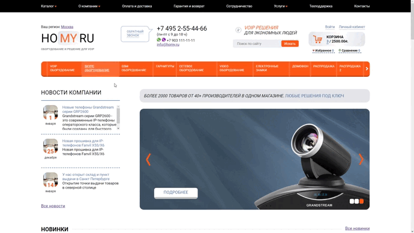
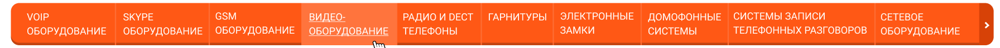
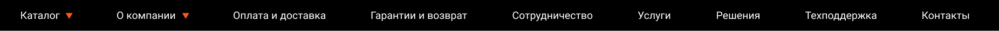
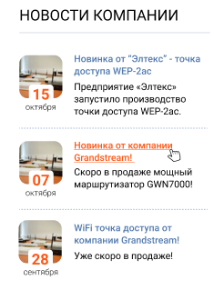
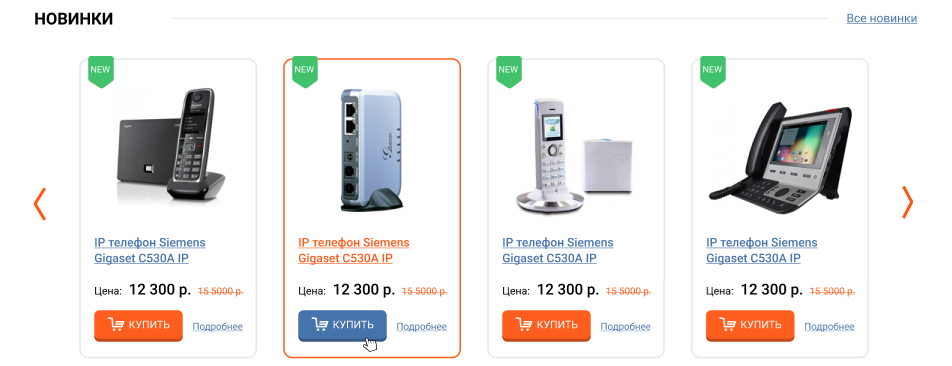
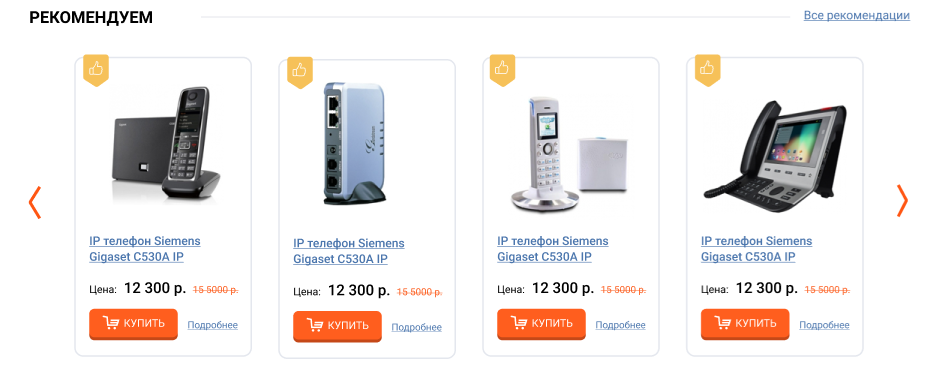
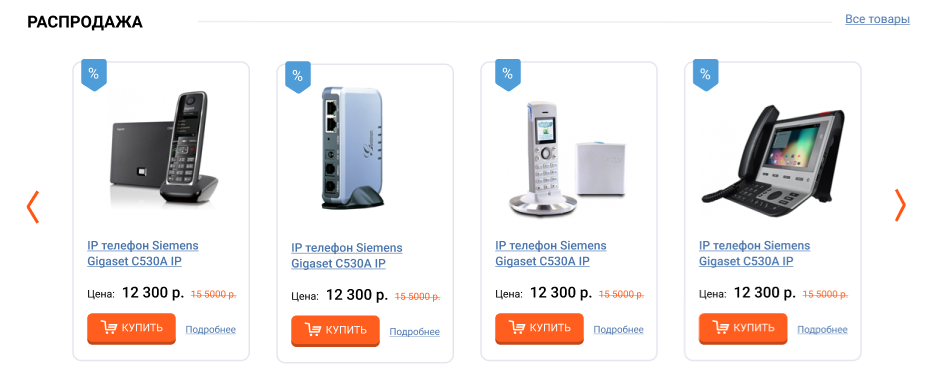
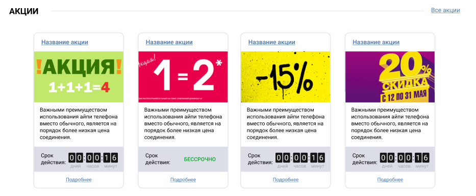
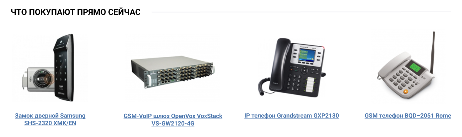
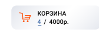

# Website Homy.ru

Данный вебсайт был мною написан в курсе от компании Parimatch Tech

С макетом вы можете в фигме по [ссылке](https://www.figma.com/file/7xlGy89Y1R2h4sSx5Dnp9R/HW-1?node-id=0%3A1)

# Применяемые технологии

- HTML
- SCSS
- Vanilla Javascript

# Работа сайта гифкой

# Техническое задание

### Требования к слайдерам
**Блок навигации** - можно прокручивать только вправо или влево, без “карусели” (т.е. дойдя до граничного элемента, стрелка становится неактивной и нет возможности листать дальше).

**Главный слайдер** - автоматически, с периодичностью (на усмотрение студента) в режиме “карусель” пролистывает слайды, но если юзер сам выбрал слайд (наведение мышкой) -  авто прокрутка прекращается. Листать слайды можно как по нажатию на стрелочки (будет выбран соответственно следующий или предыдущий) либо на квадратики (будет сразу отображен соответствующий слайд). Также обратите внимание на индикаторы страниц, квадратики должны соответствовать текущей странице слайдера.

Блок “Новинки”, “Рекомендуем”, “Распродажа” - прокрутка только вправо или влево.

### Требования к блокам
**Блок “Меню”** выводим согласно конфигурационному файлу. Может быть максимум 9 элементов. Если элементов меньше, то они равномерно занимают всю ширину.
 

 
**Блок “Навигация”** - отображает столько элементов меню, сколько будет передано в конфигурационном файле. Максимальное кол-во в видимой области - 10 элементов. Остальные - скролл. Меню занимает всю ширину, т.е. предоставленное количество элементов (учитывая максимум в видимой области) равномерно занимает всю область.

**Блок “Новости”** - вывести только 3 случайные новости из конфига, т.е. при каждой загрузке, показываются каждый раз новые 3 случайные новости.

**Блоки “Новинки”, “Рекомендуем”, “Распродажа”** - выводятся все переданные элементы в конфиге, если для какого-то блока элементов меньше чем максимум в области видимости, стрелочки для слайдера не отображать.

**Блок “Новинки”** - выводить элементы отсортировав по дате.

**Блок “Рекомендуем”** - выводить элементы отсортировав по возрастанию цены.

**Блок “Распродажа”** - выводить элементы отсортировав по разнице между старой и новой ценой (с начала те, у которых разница выше, т.е. больше скидка).

**Блок “Акции”** - вывести все значения согласно конфигурационному файлу.

**Блок “Что покупают прямо сейчас”** - вывести все значения согласно конфигурационному файлу, учитывая максимум (смотри кол-во для каждой ширины экрана).

### Общие задания:
**Корзина** - выводит сумму в той валюте, которая указана к конфиге.

По нажатию на кнопку “Купить” - корзина обновляет свой статус (увеличивается кол-во элементов, сумма пересчитывается).

Цена товаров блоков “Новинки”, “Рекомендуем”, “Распродажа” указываются в той валюте, которая указана в конфиге. Если нужно произвести “обмен” то курс валют также указан в конфиге.

Требования по выводу элементов касающихся цены, производятся в рамках валюты указанной в конфиге. Если товар предоставлен в конфиге как USD, а валюта на сайте UAH - то нужно “обменять” на гривну и вывести соответствующую цену в блоке и учитывать ее при сортировке.
